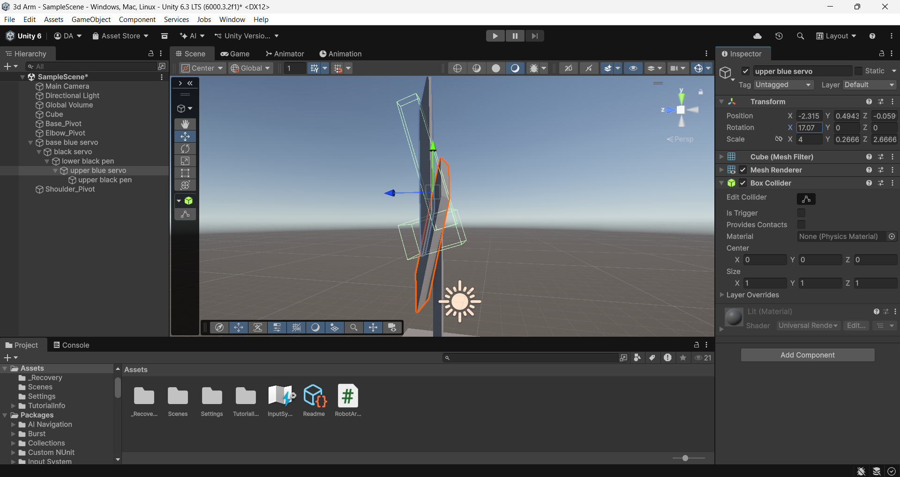
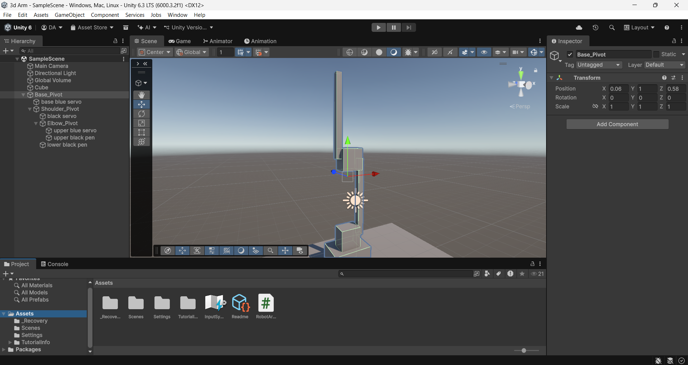
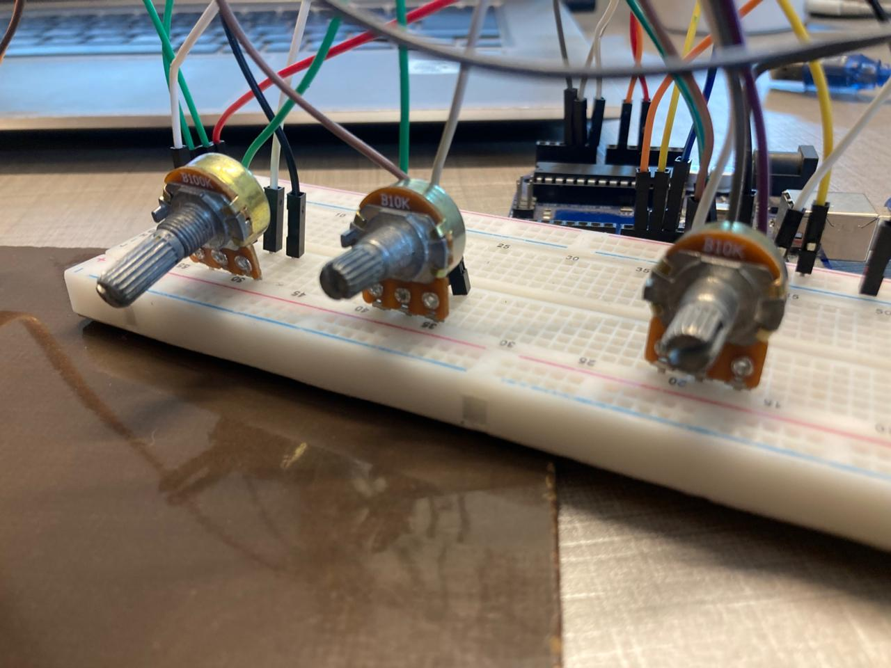
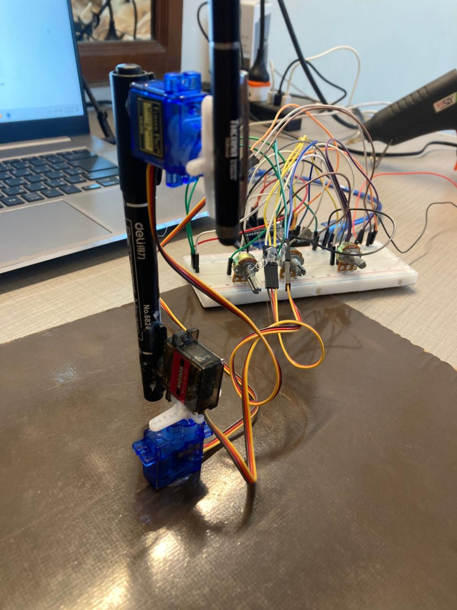

# Project Overview

This project implements a bidirectional Digital Twin system for a 3-DOF (Degrees of Freedom) servo-based robotic arm, synchronizing a physical robotic manipulator with a real-time physics simulation in Unity.

## The system enables two-way interaction:

### Physical -> Digital:

Potentiometer inputs attached to the real arm drive the Unity 3D model in real time.

### Digital -> Physical:

Joint rotations or manual posing inside Unity are transmitted back to the Arduino, physically actuating the real robot.

This project bridges the gap between embedded systems, robotics, and real-time simulation, demonstrating a complete cyber-physical control loop.

#### Demo Video

Full Demonstration Video
[Watch the full demo video](media/demo.mp4)
<video width="600" controls>
  <source src="media/demo.mp4" type="video/mp4">
  Your browser does not support the video tag.
</video>


#### Real Time Sync

Moving potentiometers -> Unity arm moving
Moving Unity arm -> physical arm moving
[Bidirectional Digital Twin Demo](media/DigitalTwin.mp4)

## Architecture Layers:

#### Hardware Layer

- Arduino Uno
- 3× SG90 / MG90S Servo Motors
- 3× 10kΩ Linear Potentiometers
- External 6V Power Supply (common ground)

#### Software Layer:

- Unity 3D Engine (C# scripts)
- Custom Virtual Arm with hierarchical joint structure
- Communication Layer
- USB Serial Communication
- Baud Rate: 9600
- Data Format:
- Joint1,Joint2,Joint3\n

## Control Modes (State Machine)

To ensure stable bidirectional communication, the system operates using a two-state control model:

### Mode 0 — Monitor Mode (Physical -> Digital)

Arduino sends potentiometer data
Unity listens and visualizes motion
Used for real-time mirroring

### Mode 1 — Control Mode (Digital -> Physical)

Unity sends joint angles
Arduino actuates servos
Used for remote control & posing

This prevents jitter, race conditions, and feedback loops.

## Key Engineering Challenges & Solutions

### Non-Uniform Matrix Scaling (Mesh Deformation)

#### Problem:

Rotating child objects in Unity caused mesh skewing and deformation due to inherited non uniform scaling.
deformed mesh:


#### Solution:

The object hierarchy was restructured by separating:
- Pivot GameObjects (Joints) scale locked to (1,1,1)
- Mesh GameObjects (Visuals) were arranged according to the physical arm

So, the best practice and the only way around the mesh deformation, is by using Empty game objects, you can see in my hierarchy, the pivots are empty game objects and the servo object and the Pen objects are the child of it. There is another catch, in unity u cant change the pivot of the 3d objects, so make rotate at a specific axis, you actually have to use an empty game object parented to the 3d object to rotate it in that axis. 



### Coordinate Frame Mismatch

#### Problem:

Physical servos and Unity’s Euler rotation system used opposite rotational directions.

#### Solution:

A mapping function was implemented in the Unity C# script:
`mappedAngle = 180 - unityAngle;`
This ensured consistent alignment regardless of servo orientation.

### Bidirectional Latency & Feedback Collision

#### Problem:

Simultaneous data transmission caused a “tug-of-war” effect and jitter.

#### Solution:

A finite state machine was implemented to explicitly control the direction of authority, eliminating feedback conflicts and ensuring deterministic behavior.

### Hardware Setup 

| Circuit View 1 | Circuit View 2 |
| :---: | :---: |
|  |  |
| **Circuit View 3** | **Circuit View 4** |
|  |  |
  
#### Components

Microcontroller: Arduino Uno

| Servos | Sensors |
| :---: | :---: |
|  |  |
| **Power** | **Safety** |
|  |  |

#### Circuit Design & Wiring

This system uses a split power rail architecture to ensure electrical stability, protect the microcontroller, and provide sufficient current to the actuators.

#### Circuit Overview

The robotic arm operates using two separate power domains:

- Control Logic (Low Power)

- Arduino Uno

- Potentiometers (Sensors)

- Powered directly via USB (5V)

- Actuation (High Power)

- Servo Motors

-Powered using an external 6V battery pack

#### Common Ground (Critical Requirement)

Although the power sources are separate, both systems share a common ground.
This shared reference is essential for correct PWM signal interpretation by the servos.

`*⚠️ Without a common ground, servos may jitter, behave erratically, or not move at all.*`

###  Pin Mapping Table

This table documents the exact electrical connections between components,,

| Component                  | Signal Pin | Power (+)   | Ground (−)                |
| -------------------------- | ---------- | ----------- | ------------------------- |
| Potentiometer 1 (Base)     | A0         | Arduino 5V  | Arduino GND               |
| Potentiometer 2 (Shoulder) | A1         | Arduino 5V  | Arduino GND               |
| Potentiometer 3 (Elbow)    | A2         | Arduino 5V  | Arduino GND               |
| Servo 1 (Base)             | D9 (PWM)   | Battery +6V | Battery GND + Arduino GND |
| Servo 2 (Shoulder)         | D10 (PWM)  | Battery +6V | Battery GND + Arduino GND |
| Servo 3 (Elbow)            | D11 (PWM)  | Battery +6V | Battery GND + Arduino GND |

### Step-by-Step Wiring Guide

#### Power Distribution (Breadboard Rails)

Logic Power (Sensors)

- Connect Arduino 5V -> Breadboard Red (+) Rail
- Connect Arduino GND -> Breadboard Blue (−) Rail
- This rail powers all potentiometers

#### Motor Power (Servos)

- Connect Battery Pack (+) -> Separate Red (+) Rail
- Connect Battery Pack (−) -> Separate Blue (−) Rail

**Common Ground (MOST IMPORTANT STEP)**

- Connect Battery GND rail to Arduino GND rail using a jumper wire

Why this matters:
PWM signals require a shared voltage reference. Without a common ground, the signal has no return path, causing unstable servo behavior.

#### Wiring the Potentiometers (Input Layer)

Potentiometers are used as **voltage dividers** to provide continuous analog input values to the Arduino, enabling precise joint position control.

#### Potentiometer Connections

For **each potentiometer**, make the following connections:

- **Left Pin** -> Arduino **5V**
- **Right Pin** -> Arduino **GND**
- **Middle Pin (Wiper)** -> Arduino **Analog Pin**

#### Potentiometer to Arduino Pin Mapping

| Potentiometer  | Arduino Pin |
| -------------- | ----------- |
| Base Joint     | A0          |
| Shoulder Joint | A1          |
| Elbow Joint    | A2          |  


### Key Components of the Code

#### 1️Serial Communication Setup
```
SerialPort sp = new SerialPort("COM3", 9600);
Thiss makes a serial connection with the Arduino board.
```
"COM3" specifies the port where Arduino is connected.
9600 is the baud rate, which must match Arduino’s serial speed. Oh u dont know what is baud rate ? The baud rate is the speed at which data is sent over a serial connection, measured in bits per second (bps).
Purpose: Establishes a data pipeline for sending joint angles to and receiving angles from the physical arm.

Unity Transforms
```
csharp
public Transform baseJoint;
public Transform shoulderJoint;
public Transform elbowJoint;
References to the 3D model’s joints in Unity.
```

Each Transform controls position, rotation, and scale.

Used to apply angles received from Arduino to the digital arm.

Manual Mode Toggle
```
bool manualMode = false;

if (Input.GetKeyDown(KeyCode.M))
{
    manualMode = !manualMode;
    Debug.Log("Manual Mode: " + manualMode);
}
```
Allows switching between automatic (Arduino to Unity) and manual (Unity to Arduino) control.

Useful to prevent conflicts when both systems try to control the arm simultaneously.

Reading Physical Arm Data
```
string data = sp.ReadLine();
string[] angles = data.Split(',');
Reads a line of text from Arduino (formatted as "base,shoulder,elbow").
```
Splits the string into individual joint angles.

Converts them to float values for Unity rotations.

Applying Euler Angles
```
baseJoint.localEulerAngles = new Vector3(0, a1, 0);
shoulderJoint.localEulerAngles = new Vector3(a2, 0, 0);
elbowJoint.localEulerAngles = new Vector3(a3, 0, 0);
Euler Angles Explained:

Represent 3D rotations using three angles (X, Y, Z axes).
```
because each axis can be rotated independently.

In this project:

- baseJoint rotates around Y-axis (horizontal swivel)

- shoulderJoint rotates around X-axis (vertical lift)

- elbowJoint rotates around X-axis (forearm bend)

#### Why Euler angles are used and what they really are ?:
Euler angles are a way to represent 3D rotations using three numbers, typically denoted as roll, pitch, and yaw (or angles around the X, Y, Z axes). Imagine an object in space just liek our robotic arm or a plane. To fully describe its orientation, you need to know how much it has rotated about each axis. Euler angles do exactly that, they tell the arm “rotate X degrees around X, Y degrees around Y, Z degrees around Z" so for visualization and control of robotic joints in 3D space

Sending Data from Unity -> Physical Arm
```
if (Input.GetKeyDown(KeyCode.S))
{
    int b = (int)baseJoint.localEulerAngles.y;
    int s = (int)shoulderJoint.localEulerAngles.x;
    int e = (int)elbowJoint.localEulerAngles.x;

    string command = b + "," + s + "," + e + "\n";
    sp.Write(command);
    Debug.Log("Sent to Physical Arm: " + command);
}
```
Captures the current digital arm angles

Formats them into a string compatible with Arduino

Sends the command through serial to move the physical servos

### Key Takeaways 
Bidirectional Control: Supports both physical to digital and digital to physical actuation

Real-Time Synchronization: Uses SerialPort for low-latency communication

Euler Angle Mapping: Intuitive 3D joint rotation control without complex math

Safety & Mode Control: Manual mode toggle prevents conflicting commands

Engineering Problem Solving: Handles coordinate system mismatches (Arduino vs Unity) by inverting axes as needed


### How to Run

### Arduino

1. Open `RobotArm.ino` in the Arduino IDE
2. Select the correct **COM port**
3. Upload the code to **Arduino Uno**

### Unity

1. Open the Unity project
2. Attach `RobotController.cs` to the controller object
3. Set the correct **Serial Port** in the Inspector
4. Press **Play** to run the simulation

## Learning Outcomes

By completing this project, you will gain experience in:

- Digital Twin system design
- Embedded–Simulation synchronization
- Serial communication protocols
- Coordinate frame transformations
- Unity hierarchical modeling
- Robotics control logic
- State machine–based control

## Future Improvements

Potential enhancements for this project include:

- Inverse kinematics solver
- ROS integration
- Sensor fusion (IMU + encoders)
- Web-based dashboard
- Multi-arm coordination

## Author

**Dawood Ahmed**  
BS Software Engineering  
Specializations: Robotics • Embedded Systems • AI • Digital Twins
