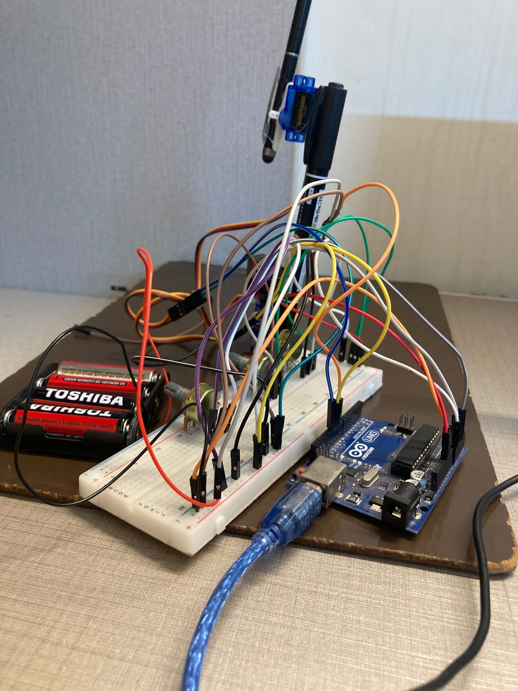
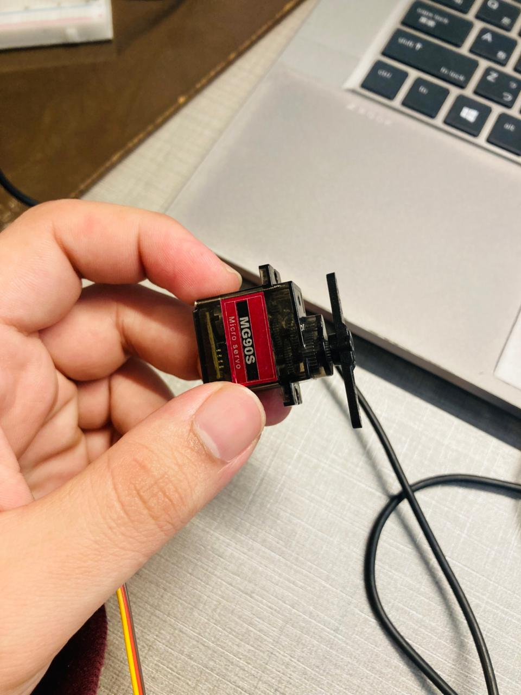
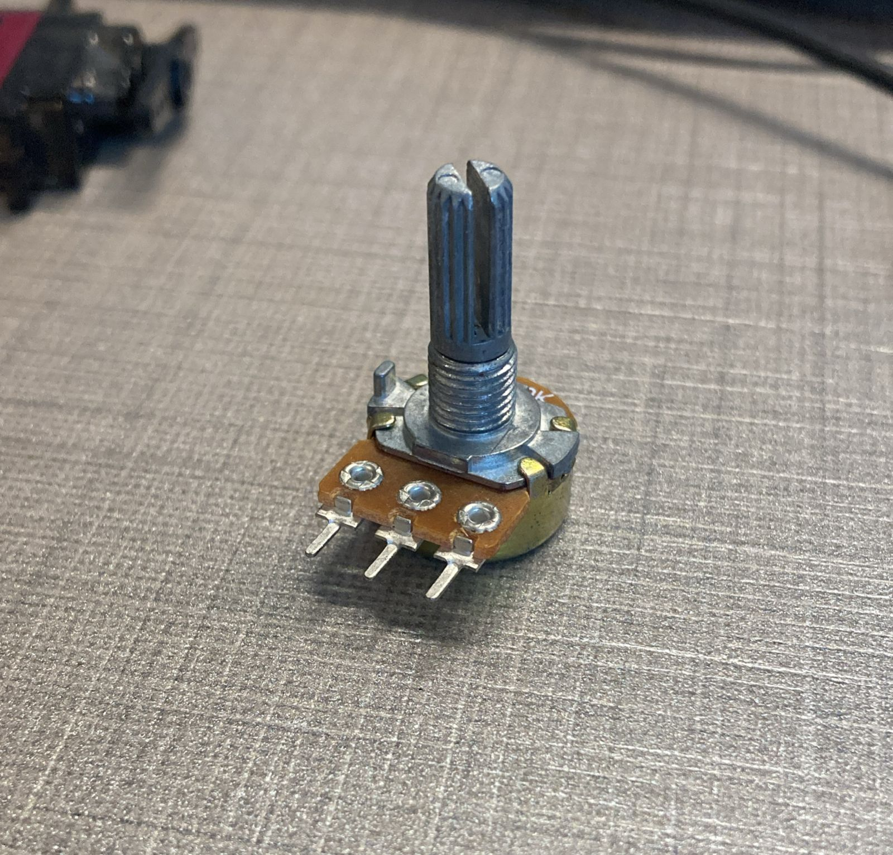
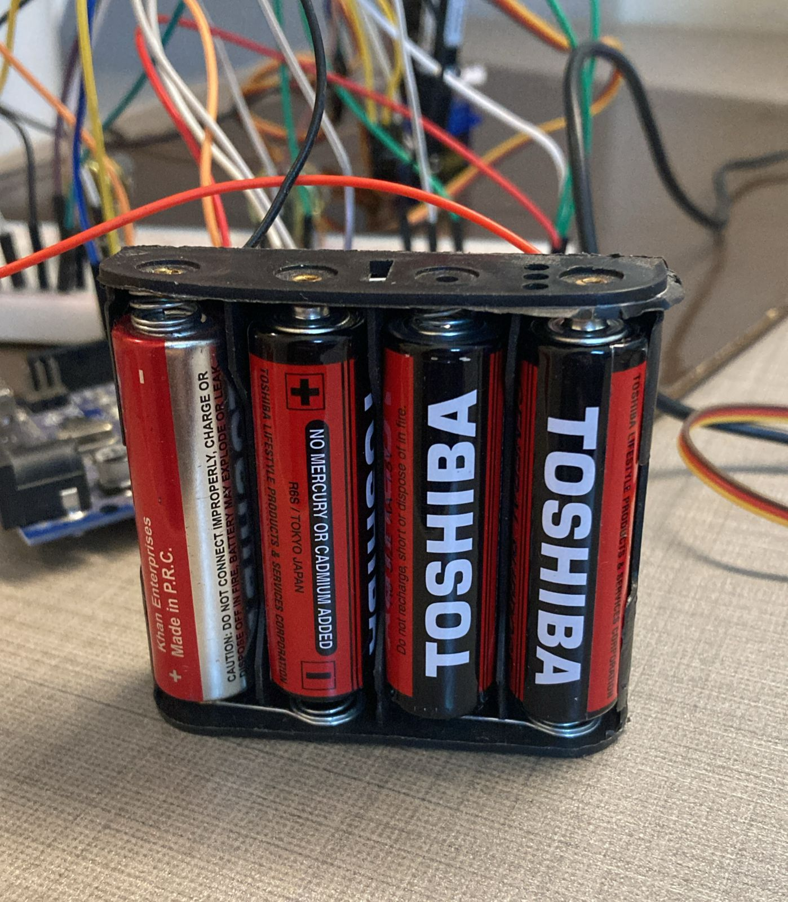
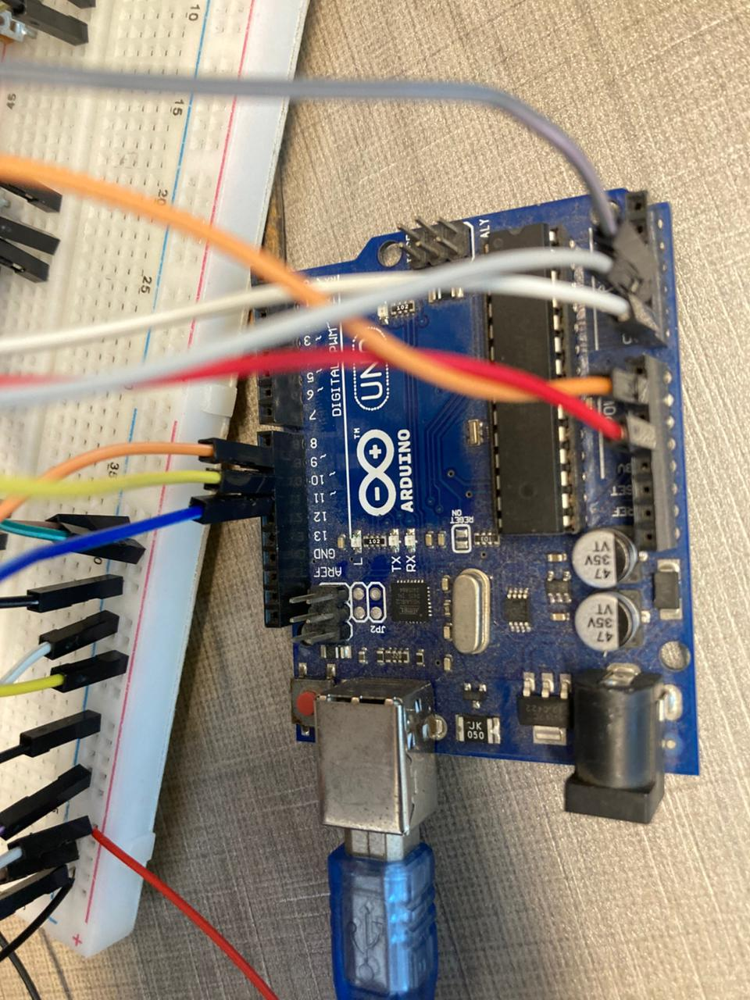

# Project Overview

This project implements a bidirectional Digital Twin system for a 3-DOF (Degrees of Freedom) servo-based robotic arm, synchronizing a physical robotic manipulator with a real-time physics simulation in Unity.

## The system enables two-way interaction:

### Physical → Digital:

Potentiometer inputs attached to the real arm drive the Unity 3D model in real time.

### Digital → Physical:

Joint rotations or manual posing inside Unity are transmitted back to the Arduino, physically actuating the real robot.

This project bridges the gap between embedded systems, robotics, and real-time simulation, demonstrating a complete cyber-physical control loop.

# Demo Video

Full Demonstration Video
[Watch the full demo video](media/demo.mp4)

# Real Time Sync

Moving potentiometers → Unity arm moving
Moving Unity arm → physical arm moving
[Bidirectional Digital Twin Demo](media/DigitalTwin.mp4)

# Architecture Layers:

### Hardware Layer

- Arduino Uno
- 3× SG90 / MG90S Servo Motors
- 3× 10kΩ Linear Potentiometers
- External 6V Power Supply (common ground)

### Software Layer:

- Unity 3D Engine (C# scripts)
- Custom Virtual Arm with hierarchical joint structure
- Communication Layer
- USB Serial Communication
- Baud Rate: 9600
- Data Format:
- Joint1,Joint2,Joint3\n

## Control Modes (State Machine)

To ensure stable bidirectional communication, the system operates using a two-state control model:

### Mode 0 — Monitor Mode (Physical → Digital)

Arduino sends potentiometer data
Unity listens and visualizes motion
Used for real-time mirroring

### Mode 1 — Control Mode (Digital → Physical)

Unity sends joint angles
Arduino actuates servos
Used for remote control & posing

This prevents jitter, race conditions, and feedback loops.

# Key Engineering Challenges & Solutions

## Non-Uniform Matrix Scaling (Mesh Deformation)

### Problem:

Rotating child objects in Unity caused mesh skewing and deformation due to inherited non uniform scaling.
[Deformed mesh](media/MeshDeformation.png)

### Solution:

The object hierarchy was restructured by separating:
[Fixed](media/hierarchyRestructuredAndAddedPivots.png)

- Pivot GameObjects (Joints) — scale locked to (1,1,1)
- Mesh GameObjects (Visuals) — Were arranged according to the physical arm
  This ensured rotation matrices were applied cleanly without distorting geometry.

## Coordinate Frame Mismatch

### Problem:

Physical servos and Unity’s Euler rotation system used opposite rotational directions.

### Solution:

A mapping function was implemented in the Unity C# script:
`mappedAngle = 180 - unityAngle;`
This ensured consistent alignment regardless of servo orientation.

## Bidirectional Latency & Feedback Collision

### Problem:

Simultaneous data transmission caused a “tug-of-war” effect and jitter.

### Solution:

A finite state machine was implemented to explicitly control the direction of authority, eliminating feedback conflicts and ensuring deterministic behavior.

# Hardware Setup

## Components

Microcontroller: Arduino Uno

- Servos: 3× SG90 / MG90S
  
- Sensors: 3× 10kΩ Potentiometers
  
- Power: External 4×AA Battery Pack
  
- Safety: Common ground between Arduino and external power
  

# Circuit Design & Wiring

This system uses a split power rail architecture to ensure electrical stability, protect the microcontroller, and provide sufficient current to the actuators.

## Circuit Overview

The robotic arm operates using two separate power domains:

- Control Logic (Low Power)

- Arduino Uno

- Potentiometers (Sensors)

- Powered directly via USB (5V)

- Actuation (High Power)

- Servo Motors

-Powered using an external 6V battery pack

#### Common Ground (Critical Requirement)

Although the power sources are separate, both systems share a common ground.
This shared reference is essential for correct PWM signal interpretation by the servos.

`*⚠️ Without a common ground, servos may jitter, behave erratically, or not move at all.*`

## 🔌 Pin Mapping Table

This table documents the exact electrical connections between components,,

| Component                  | Signal Pin | Power (+)   | Ground (−)                |
| -------------------------- | ---------- | ----------- | ------------------------- |
| Potentiometer 1 (Base)     | A0         | Arduino 5V  | Arduino GND               |
| Potentiometer 2 (Shoulder) | A1         | Arduino 5V  | Arduino GND               |
| Potentiometer 3 (Elbow)    | A2         | Arduino 5V  | Arduino GND               |
| Servo 1 (Base)             | D9 (PWM)   | Battery +6V | Battery GND + Arduino GND |
| Servo 2 (Shoulder)         | D10 (PWM)  | Battery +6V | Battery GND + Arduino GND |
| Servo 3 (Elbow)            | D11 (PWM)  | Battery +6V | Battery GND + Arduino GND |

## Step-by-Step Wiring Guide

### Power Distribution (Breadboard Rails)

Logic Power (Sensors)

- Connect Arduino 5V → Breadboard Red (+) Rail
- Connect Arduino GND → Breadboard Blue (−) Rail
- This rail powers all potentiometers

### Motor Power (Servos)

- Connect Battery Pack (+) → Separate Red (+) Rail
- Connect Battery Pack (−) → Separate Blue (−) Rail

**Common Ground (MOST IMPORTANT STEP)**

- Connect Battery GND rail to Arduino GND rail using a jumper wire

Why this matters:
PWM signals require a shared voltage reference. Without a common ground, the signal has no return path, causing unstable servo behavior.

## 🎛️ Wiring the Potentiometers (Input Layer)

Potentiometers are used as **voltage dividers** to provide continuous analog input values to the Arduino, enabling precise joint position control.

### 🔧 Potentiometer Connections

For **each potentiometer**, make the following connections:

- **Left Pin** → Arduino **5V**
- **Right Pin** → Arduino **GND**
- **Middle Pin (Wiper)** → Arduino **Analog Pin**

### 📌 Potentiometer to Arduino Pin Mapping

| Potentiometer  | Arduino Pin |
| -------------- | ----------- |
| Base Joint     | A0          |
| Shoulder Joint | A1          |
| Elbow Joint    | A2          |

## 🚀 How to Run

### Arduino

1. Open `RobotArm.ino` in the Arduino IDE
2. Select the correct **COM port**
3. Upload the code to **Arduino Uno**

### Unity

1. Open the Unity project
2. Attach `RobotController.cs` to the controller object
3. Set the correct **Serial Port** in the Inspector
4. Press **Play** to run the simulation

## 🎯 Learning Outcomes

By completing this project, you will gain experience in:

- Digital Twin system design
- Embedded–Simulation synchronization
- Serial communication protocols
- Coordinate frame transformations
- Unity hierarchical modeling
- Robotics control logic
- State machine–based control

## 📚 Future Improvements

Potential enhancements for this project include:

- Inverse kinematics solver
- ROS integration
- Sensor fusion (IMU + encoders)
- Web-based dashboard
- Multi-arm coordination

## 👤 Author

**Dawood Ahmed**  
BS Software Engineering  
Specializations: Robotics • Embedded Systems • AI • Digital Twins
